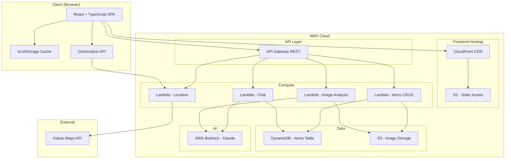
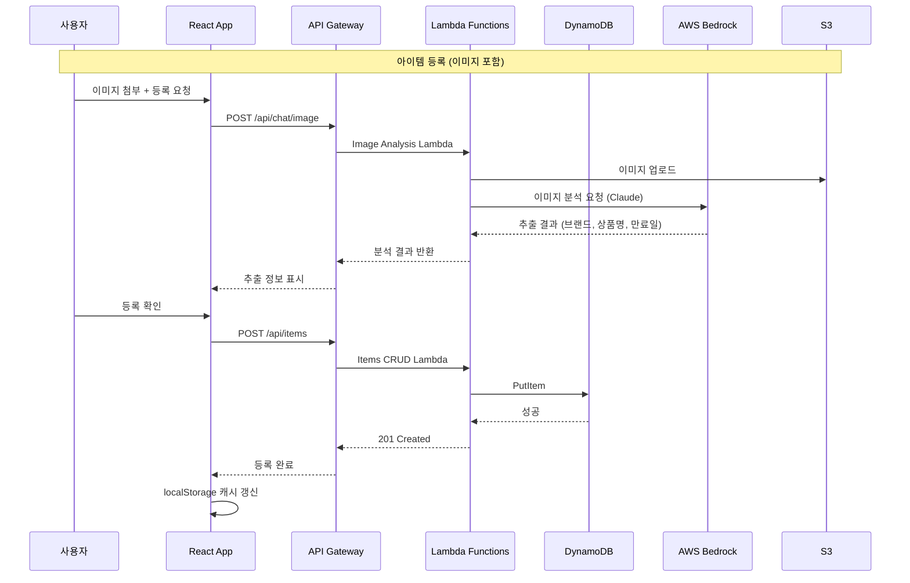
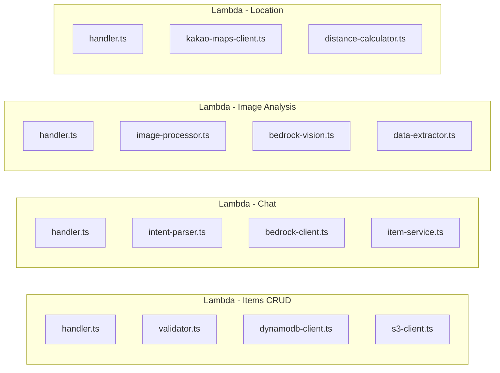
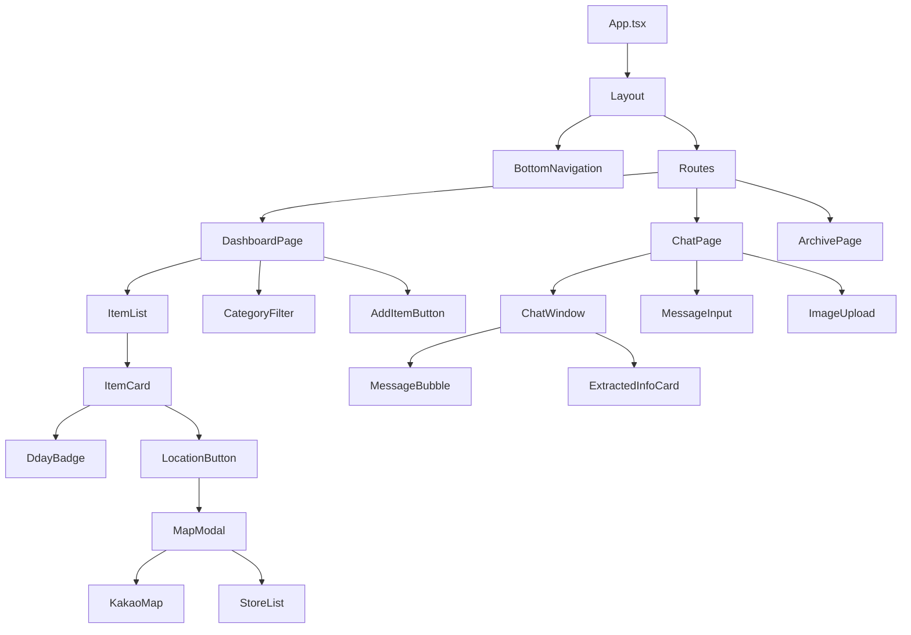

# Design Document: 만료일/소비기한 알림 대시보드

## Overview

만료일/소비기한 알림 대시보드는 기프티콘, 식재료, 정기결제 등의 만료일을 한눈에 관리하는 초경량 서버리스 웹 애플리케이션이다. 단일 사용자 기준으로 동작하며, React + TypeScript 프론트엔드와 AWS Lambda + API Gateway 백엔드, DynamoDB 데이터베이스로 구성된다.

### 핵심 설계 목표

- **1일 MVP 완성 가능한 최소 복잡도**: 불필요한 추상화 없이 직관적인 구조
- **서버리스 아키텍처**: 운영 부담 제거, 사용량 기반 비용
- **모바일 퍼스트**: 일상에서 빠르게 확인 가능한 반응형 UI
- **AI 통합**: AWS Bedrock Claude를 활용한 이미지 분석 및 자연어 인터페이스

### 설계 결정 사항

| 결정 | 선택 | 근거 |
|------|------|------|
| 상태 관리 | React Context + useReducer | 1일 MVP, 단일 사용자, 복잡도 낮음 |
| API 통신 | fetch + custom hooks | 외부 라이브러리 최소화 |
| 라우팅 | React Router v6 | SPA 내 페이지 전환 |
| 지도 API | Kakao Maps API | 한국 내 매장 검색 최적화 |
| 인프라 | AWS CDK (TypeScript) | 코드 기반 인프라, 타입 안전성 |
| 오프라인 캐시 | localStorage | 단순, 브라우저 내장, 추가 의존성 없음 |

## Architecture

### High-Level Architecture



### 요청 흐름



### Low-Level Architecture: Lambda Function 구조



## Components and Interfaces

### 프론트엔드 컴포넌트 구조



### 백엔드 API 인터페이스

```typescript
// === Items CRUD API ===

// POST /api/items - 아이템 생성
interface CreateItemRequest {
  name: string;              // 1~50자
  category: Category;
  subcategory?: string;
  expiryDate: string;        // ISO 8601 (YYYY-MM-DD)
  brand?: string;
  memo?: string;
  imageBase64?: string;      // Base64 인코딩된 이미지 (5MB 이하)
  imageContentType?: 'image/jpeg' | 'image/png' | 'image/webp';
}

interface CreateItemResponse {
  id: string;
  name: string;
  category: Category;
  subcategory?: string;
  expiryDate: string;
  brand?: string;
  memo?: string;
  imageUrl?: string;
  createdAt: string;
  isArchived: boolean;
}

// GET /api/items?category={category}&archived={boolean}
interface GetItemsResponse {
  items: ItemSummary[];
  count: number;
}

interface ItemSummary {
  id: string;
  name: string;
  category: Category;
  expiryDate: string;
  dday: number;           // 양수: 남은 일수, 음수: 만료 후 경과 일수
  brand?: string;
  imageUrl?: string;
}

// GET /api/items/:id
interface GetItemDetailResponse extends CreateItemResponse {
  dday: number;
}

// PUT /api/items/:id
interface UpdateItemRequest {
  name?: string;
  category?: Category;
  subcategory?: string;
  expiryDate?: string;
  brand?: string;
  memo?: string;
  imageBase64?: string;
  imageContentType?: string;
}

// DELETE /api/items/:id
interface DeleteItemResponse {
  message: string;
}

// === Chat API ===

// POST /api/chat
interface ChatRequest {
  message: string;
  conversationHistory?: ChatMessage[];
}

interface ChatMessage {
  role: 'user' | 'assistant';
  content: string;
}

interface ChatResponse {
  message: string;
  action?: {
    type: 'create' | 'list' | 'delete' | 'confirm_delete';
    data?: any;
  };
  items?: ItemSummary[];     // 조회 결과
}

// POST /api/chat/image
interface ImageAnalysisRequest {
  imageBase64: string;
  imageContentType: 'image/jpeg' | 'image/png' | 'image/webp';
}

interface ImageAnalysisResponse {
  success: boolean;
  imageType: 'gifticon' | 'food_label' | 'subscription' | 'unknown';
  extractedData: {
    name?: string;
    brand?: string;
    expiryDate?: string;
    category?: Category;
    subcategory?: string;
  };
  confidence: number;        // 0.0 ~ 1.0
  message: string;
}

// === Location API ===

// GET /api/locations/:brand?lat={lat}&lng={lng}&radius={radius}
interface LocationSearchRequest {
  brand: string;
  lat: number;
  lng: number;
  radius?: number;          // km, 기본값 5
}

interface LocationSearchResponse {
  stores: Store[];
  count: number;
}

interface Store {
  name: string;
  address: string;
  lat: number;
  lng: number;
  distance: number;         // km
  phone?: string;
}

// === 공통 타입 ===

type Category = 'gifticon' | 'food' | 'subscription' | 'other';

interface ApiError {
  error: string;
  message: string;
  details?: string[];
}
```

### 프론트엔드 주요 Hook 인터페이스

```typescript
// useItems - 아이템 CRUD 상태 관리
interface UseItemsReturn {
  items: ItemSummary[];
  loading: boolean;
  error: string | null;
  isOffline: boolean;
  fetchItems: (category?: Category) => Promise<void>;
  createItem: (data: CreateItemRequest) => Promise<CreateItemResponse>;
  updateItem: (id: string, data: UpdateItemRequest) => Promise<void>;
  deleteItem: (id: string) => Promise<void>;
  archiveExpired: () => Promise<void>;
}

// useChat - 챗봇 상태 관리
interface UseChatReturn {
  messages: ChatMessage[];
  loading: boolean;
  sendMessage: (message: string) => Promise<void>;
  sendImage: (file: File) => Promise<ImageAnalysisResponse>;
  confirmAction: (action: any) => Promise<void>;
}

// useLocation - 위치 기반 검색
interface UseLocationReturn {
  currentPosition: { lat: number; lng: number } | null;
  stores: Store[];
  loading: boolean;
  error: string | null;
  searchStores: (brand: string) => Promise<void>;
}

// useOfflineCache - 오프라인 캐시 관리
interface UseOfflineCacheReturn {
  getCachedItems: () => ItemSummary[] | null;
  setCachedItems: (items: ItemSummary[]) => void;
  getCacheTimestamp: () => string | null;
  clearCache: () => void;
}
```

## Data Models

### DynamoDB 테이블 설계

**테이블명**: `expiry-dashboard-items`

| Attribute | Type | 설명 |
|-----------|------|------|
| id (PK) | String | UUID v4 |
| name | String | 아이템 이름 (1~50자) |
| category | String | 'gifticon' \| 'food' \| 'subscription' \| 'other' |
| subcategory | String | 서브카테고리 (optional) |
| expiryDate | String | ISO 8601 날짜 (YYYY-MM-DD) |
| brand | String | 브랜드명 (optional) |
| memo | String | 메모 (optional) |
| imageUrl | String | S3 이미지 URL (optional) |
| createdAt | String | ISO 8601 타임스탬프 |
| isArchived | Boolean | 아카이브 여부 |

**GSI (Global Secondary Index)**:

| 인덱스 | PK | SK | 용도 |
|--------|----|----|------|
| category-expiryDate-index | category | expiryDate | 카테고리별 만료일 순 조회 |
| isArchived-expiryDate-index | isArchived | expiryDate | 활성/아카이브 분리 조회 |

### S3 버킷 구조

```
expiry-dashboard-images/
├── items/
│   ├── {item-id}/
│   │   └── image.{ext}        # 등록된 아이템 이미지
│   └── ...
└── temp/
    └── {upload-id}.{ext}       # 분석 중 임시 이미지
```

### localStorage 캐시 구조

```typescript
interface LocalStorageSchema {
  'expiry-dashboard-items': {
    data: ItemSummary[];
    timestamp: string;          // ISO 8601
  };
  'expiry-dashboard-chat-history': ChatMessage[];  // 최근 50개
}
```

### D-day 계산 로직

```typescript
// D-day 계산 순수 함수
function calculateDday(expiryDate: string, today: string): number {
  const expiry = new Date(expiryDate);
  const now = new Date(today);
  // 시간 제거, 날짜만 비교
  expiry.setHours(0, 0, 0, 0);
  now.setHours(0, 0, 0, 0);
  const diffMs = expiry.getTime() - now.getTime();
  return Math.ceil(diffMs / (1000 * 60 * 60 * 24));
}

// 색상 결정 순수 함수
type UrgencyColor = 'red' | 'orange' | 'green' | 'gray';

function getUrgencyColor(dday: number): UrgencyColor {
  if (dday < 0) return 'gray';
  if (dday <= 3) return 'red';
  if (dday <= 7) return 'orange';
  return 'green';
}

// 정렬 순수 함수: 만료된 아이템은 하단, 나머지는 만료일 가까운 순
function sortItemsByExpiry(items: ItemSummary[]): ItemSummary[] {
  return [...items].sort((a, b) => {
    if (a.dday < 0 && b.dday >= 0) return 1;
    if (a.dday >= 0 && b.dday < 0) return -1;
    return a.dday - b.dday;
  });
}

// 카테고리 필터 순수 함수
function filterByCategory(items: ItemSummary[], category: Category | null): ItemSummary[] {
  if (!category) return items;
  return items.filter(item => item.category === category);
}
```

### 아이템 유효성 검증 로직

```typescript
interface ValidationResult {
  valid: boolean;
  errors: string[];
}

function validateCreateItem(data: Partial<CreateItemRequest>): ValidationResult {
  const errors: string[] = [];

  if (!data.name || data.name.trim().length === 0) {
    errors.push('이름은 필수 항목입니다.');
  } else if (data.name.trim().length > 50) {
    errors.push('이름은 50자 이하여야 합니다.');
  }

  if (!data.category) {
    errors.push('카테고리는 필수 항목입니다.');
  } else if (!['gifticon', 'food', 'subscription', 'other'].includes(data.category)) {
    errors.push('유효하지 않은 카테고리입니다.');
  }

  if (!data.expiryDate) {
    errors.push('만료일은 필수 항목입니다.');
  }

  return { valid: errors.length === 0, errors };
}
```

## Correctness Properties

*A property is a characteristic or behavior that should hold true across all valid executions of a system — essentially, a formal statement about what the system should do. Properties serve as the bridge between human-readable specifications and machine-verifiable correctness guarantees.*

### Property 1: 아이템 생성 유효성 검증

*For any* 아이템 생성 요청에서, 이름이 1자 이상 50자 이하이고, 카테고리가 유효한 4개 값 중 하나이고, 만료일이 유효한 날짜이면 검증이 통과하며, 이 조건 중 하나라도 위반되면 검증이 실패하고 위반된 항목을 명시하는 오류 목록이 반환된다.

**Validates: Requirements 1.1, 1.5**

### Property 2: 생성된 아이템의 불변 속성

*For any* 유효한 아이템 생성 요청이 성공하면, 반환된 아이템에는 UUID v4 형식의 고유 id와 유효한 ISO 8601 타임스탬프 형식의 createdAt이 존재하며, isArchived는 false이다.

**Validates: Requirements 1.2**

### Property 3: 이미지 업로드 검증

*For any* 이미지 업로드 요청에서, 파일 크기가 5MB 이하이고 형식이 JPEG, PNG, WEBP 중 하나이면 업로드가 허용되며, 크기가 5MB를 초과하거나 형식이 그 외이면 거부된다.

**Validates: Requirements 1.4**

### Property 4: 아이템 CRUD 라운드트립

*For any* 유효한 아이템 데이터를 생성한 후 해당 id로 상세 조회하면, 생성 시 입력한 모든 필드(name, category, subcategory, expiryDate, brand, memo)가 동일하게 반환된다.

**Validates: Requirements 2.3, 3.1**

### Property 5: 아이템 삭제 후 조회 불가

*For any* 존재하는 아이템을 삭제한 후 해당 id로 조회하면, 아이템을 찾을 수 없다는 오류가 반환된다.

**Validates: Requirements 4.1**

### Property 6: D-day 계산 정확성

*For any* 만료일(expiryDate)과 현재 날짜(today)의 조합에서, calculateDday(expiryDate, today)는 두 날짜 간의 일수 차이를 정확하게 반환하며, 만료 전이면 양수, 만료일 당일이면 0, 만료 후이면 음수이다.

**Validates: Requirements 6.1**

### Property 7: 긴급도 색상 코딩

*For any* 정수 D-day 값에 대해, getUrgencyColor 함수는 다음을 만족한다: D-day < 0이면 'gray', 0 ≤ D-day ≤ 3이면 'red', 4 ≤ D-day ≤ 7이면 'orange', D-day ≥ 8이면 'green'을 반환하며, 이 네 범위가 정수 전체를 빠짐없이 커버한다.

**Validates: Requirements 6.2, 6.3, 6.4, 6.5**

### Property 8: 대시보드 정렬 불변식

*For any* 아이템 목록에 대해 sortItemsByExpiry를 적용하면, (1) 결과에서 모든 비만료 아이템(dday ≥ 0)이 만료 아이템(dday < 0)보다 앞에 위치하고, (2) 비만료 그룹 내에서 dday는 비감소순이며, (3) 만료 그룹 내에서 dday는 비감소순이다.

**Validates: Requirements 2.1, 6.6**

### Property 9: 카테고리 필터링

*For any* 아이템 목록과 카테고리 값(null 포함)에 대해, filterByCategory를 적용하면: (1) 카테고리가 null이면 원본과 동일한 아이템을 반환하고, (2) 카테고리가 지정되면 반환된 모든 아이템의 category가 해당 값과 일치하며, (3) 원본에서 해당 카테고리인 아이템이 누락되지 않는다.

**Validates: Requirements 2.2, 6.7, 6.8**

### Property 10: 만료 아이템 자동 아카이브

*For any* 아이템 목록과 현재 날짜에 대해, 아카이브 로직 실행 후 만료일이 현재 날짜 이전인 모든 아이템은 isArchived=true가 되고, 만료일이 현재 날짜 이후인 아이템의 isArchived 상태는 변경되지 않는다.

**Validates: Requirements 5.1**

### Property 11: 아카이브/복원 라운드트립

*For any* 활성 아이템을 아카이브한 후 복원하면, 해당 아이템의 isArchived는 false이며 원래의 모든 필드 데이터가 보존된다.

**Validates: Requirements 5.4**

### Property 12: 수정 시 필수 항목 null 거부

*For any* 존재하는 아이템에 대해, name, category, expiryDate 중 하나를 null 또는 빈 문자열로 수정 시도하면, 오류가 반환되고 원본 아이템 데이터가 변경되지 않는다.

**Validates: Requirements 3.4**

### Property 13: 이미지 분석 요청 검증

*For any* 이미지 분석 요청에서, 파일 크기가 10MB 이하이고 형식이 JPEG, PNG, WEBP 중 하나이면 분석이 허용되며, 그 외이면 지원 형식 및 크기 제한을 명시하는 오류가 반환된다.

**Validates: Requirements 8.1, 8.9**

### Property 14: 위치 검색 거리 필터

*For any* 중심 좌표와 매장 좌표 목록에 대해, 반경 5km 필터를 적용하면 결과에 포함된 모든 매장의 중심까지 거리가 5km 이하이며, 원본에서 5km 이내인 매장이 누락되지 않는다.

**Validates: Requirements 9.2**

### Property 15: 거리 포맷팅

*For any* 양수 거리 값(km)에 대해, formatDistance 함수는 소수점 첫째 자리까지 반올림한 "N.Nkm" 형식의 문자열을 반환한다.

**Validates: Requirements 9.3**

### Property 16: 매장 거리순 정렬

*For any* 매장 목록에 대해 거리 순 정렬을 적용하면, 결과에서 모든 인접 쌍 (stores[i], stores[i+1])에 대해 stores[i].distance ≤ stores[i+1].distance가 성립한다.

**Validates: Requirements 9.4**

### Property 17: 오프라인 캐시 라운드트립

*For any* 유효한 아이템 목록을 localStorage 캐시에 저장한 후 읽으면, 저장한 데이터와 동일한 아이템 목록이 반환되며 타임스탬프가 유효한 ISO 8601 형식이다.

**Validates: Requirements 11.1**

## Error Handling

### 프론트엔드 에러 처리 전략

| 에러 유형 | 처리 방식 | 사용자 메시지 |
|-----------|-----------|---------------|
| 네트워크 오류 | 오프라인 캐시 폴백 + 재시도 | "오프라인 상태입니다. 캐시된 데이터를 표시합니다." |
| API 4xx 에러 | 에러 메시지 표시 | 서버 응답의 message 필드 표시 |
| API 5xx 에러 | 재시도(3회) + 에러 표시 | "서버 오류가 발생했습니다. 잠시 후 다시 시도해주세요." |
| 타임아웃 | 에러 표시 + 재시도 버튼 | "응답 시간이 초과되었습니다. 다시 시도하시겠습니까?" |
| 이미지 업로드 실패 | 이미지 없이 진행 허용 | "이미지 업로드에 실패했습니다. 이미지 없이 등록하시겠습니까?" |
| Geolocation 거부 | 위치 검색 비활성화 | "위치 권한이 필요합니다. 브라우저 설정에서 허용해주세요." |
| Geolocation 타임아웃 | 재시도 옵션 제공 | "위치를 가져올 수 없습니다. 다시 시도하시겠습니까?" |

### 백엔드 에러 처리 전략

```typescript
// 공통 에러 응답 형식
interface ErrorResponse {
  error: string;        // 에러 코드 (예: 'VALIDATION_ERROR', 'NOT_FOUND')
  message: string;      // 사용자 친화적 메시지
  details?: string[];   // 상세 오류 (유효성 검증 실패 시)
}

// HTTP 상태 코드 매핑
// 400 - 유효성 검증 실패, 잘못된 요청
// 404 - 아이템/리소스 없음
// 413 - 이미지 크기 초과
// 415 - 지원하지 않는 이미지 형식
// 429 - Bedrock API 속도 제한
// 500 - 내부 서버 오류
// 502 - Bedrock/외부 API 오류
// 504 - Bedrock/외부 API 타임아웃
```

### Lambda 에러 처리 패턴

```typescript
// 공통 에러 핸들러 미들웨어
async function errorHandler(handler: Function) {
  try {
    return await handler();
  } catch (error) {
    if (error instanceof ValidationError) {
      return { statusCode: 400, body: JSON.stringify({ error: 'VALIDATION_ERROR', message: error.message, details: error.details }) };
    }
    if (error instanceof NotFoundError) {
      return { statusCode: 404, body: JSON.stringify({ error: 'NOT_FOUND', message: error.message }) };
    }
    if (error.name === 'ThrottlingException') {
      return { statusCode: 429, body: JSON.stringify({ error: 'RATE_LIMITED', message: '요청이 너무 많습니다. 잠시 후 다시 시도해주세요.' }) };
    }
    // 예상치 못한 에러 - 로깅 후 500 반환
    console.error('Unhandled error:', error);
    return { statusCode: 500, body: JSON.stringify({ error: 'INTERNAL_ERROR', message: '서버 오류가 발생했습니다.' }) };
  }
}
```

### AWS Bedrock 에러 처리

| Bedrock 에러 | 처리 방식 |
|--------------|-----------|
| ThrottlingException | 지수 백오프 재시도 (최대 3회) |
| ModelTimeoutException | 504 반환 + 프론트엔드에서 재시도 옵션 |
| ValidationException | 400 반환 (이미지 형식/크기 문제) |
| AccessDeniedException | 500 반환 + CloudWatch 알림 |
| ServiceUnavailableException | 502 반환 + 재시도 안내 |

### 데이터 무결성 보호

- DynamoDB 조건부 쓰기(ConditionExpression)를 활용하여 아이템 존재 여부 확인 후 업데이트/삭제
- 삭제 실패 시 아이템 데이터 보존 보장 (Requirements 4.4)
- 이미지 업로드와 아이템 생성 분리: 이미지 실패 시 아이템만 생성 허용 (Requirements 1.6)

## Testing Strategy

### 테스트 프레임워크

| 계층 | 도구 | 용도 |
|------|------|------|
| 단위 테스트 | Vitest | 순수 함수, 비즈니스 로직 |
| Property 테스트 | fast-check + Vitest | 정확성 속성 검증 |
| 통합 테스트 | Vitest + MSW | API 호출, 외부 서비스 모킹 |
| 컴포넌트 테스트 | Vitest + Testing Library | React 컴포넌트 |
| E2E 테스트 | Playwright (선택) | 전체 사용자 플로우 |

### Property-Based Testing 설정

- **라이브러리**: [fast-check](https://github.com/dubzzz/fast-check) (TypeScript 네이티브, Vitest 호환)
- **최소 반복 횟수**: 100회 (각 property 테스트)
- **태그 형식**: `Feature: expiry-notification-dashboard, Property {number}: {title}`

### 테스트 구조

```
tests/
├── unit/
│   ├── dday.test.ts              # Property 6, 7
│   ├── sorting.test.ts           # Property 8, 16
│   ├── filtering.test.ts         # Property 9
│   ├── validation.test.ts        # Property 1, 3, 12, 13
│   ├── archive.test.ts           # Property 10, 11
│   ├── location.test.ts          # Property 14, 15
│   └── cache.test.ts             # Property 17
├── integration/
│   ├── items-crud.test.ts        # Property 2, 4, 5
│   ├── chat.test.ts              # Bedrock 모킹 통합 테스트
│   ├── image-analysis.test.ts    # 이미지 분석 모킹 테스트
│   └── location-search.test.ts   # Kakao Maps 모킹 테스트
├── component/
│   ├── DashboardPage.test.tsx    # 대시보드 렌더링
│   ├── ItemCard.test.tsx         # 아이템 카드 UI
│   ├── ChatWindow.test.tsx       # 채팅 UI
│   └── MapModal.test.tsx         # 지도 모달 UI
└── e2e/ (선택)
    ├── item-flow.spec.ts         # 아이템 등록~삭제 전체 흐름
    └── chat-flow.spec.ts         # 채팅 기반 등록 흐름
```

### Property 테스트 예시

```typescript
import { fc } from '@fast-check/vitest';
import { describe, it, expect } from 'vitest';
import { calculateDday, getUrgencyColor, sortItemsByExpiry, filterByCategory } from '../src/utils';

// Feature: expiry-notification-dashboard, Property 6: D-day 계산 정확성
describe('D-day calculation', () => {
  it.prop([fc.date(), fc.date()])('returns correct day difference', (expiryDate, today) => {
    const result = calculateDday(expiryDate.toISOString().split('T')[0], today.toISOString().split('T')[0]);
    const expected = Math.ceil((expiryDate.getTime() - today.getTime()) / (1000 * 60 * 60 * 24));
    expect(result).toBe(expected);
  });
});

// Feature: expiry-notification-dashboard, Property 7: 긴급도 색상 코딩
describe('Urgency color coding', () => {
  it.prop([fc.integer()])('maps all integers to valid colors', (dday) => {
    const color = getUrgencyColor(dday);
    if (dday < 0) expect(color).toBe('gray');
    else if (dday <= 3) expect(color).toBe('red');
    else if (dday <= 7) expect(color).toBe('orange');
    else expect(color).toBe('green');
  });
});

// Feature: expiry-notification-dashboard, Property 8: 대시보드 정렬 불변식
describe('Dashboard sorting', () => {
  it.prop([fc.array(fc.record({ dday: fc.integer() }))])('maintains sort invariant', (items) => {
    const sorted = sortItemsByExpiry(items as any);
    for (let i = 0; i < sorted.length - 1; i++) {
      if (sorted[i].dday >= 0 && sorted[i + 1].dday < 0) continue; // OK: active before expired
      if (sorted[i].dday < 0 && sorted[i + 1].dday >= 0) fail('Expired before active');
      expect(sorted[i].dday).toBeLessThanOrEqual(sorted[i + 1].dday);
    }
  });
});
```

### 단위 테스트 커버리지 목표

| 모듈 | 목표 커버리지 |
|------|--------------|
| 유효성 검증 함수 | 95% |
| D-day / 색상 / 정렬 / 필터 유틸 | 100% |
| 캐시 로직 | 90% |
| API 핸들러 | 85% |
| React 컴포넌트 | 70% |

### 통합 테스트 전략

- **MSW (Mock Service Worker)**: API Gateway 응답 모킹
- **AWS SDK 모킹**: DynamoDB, S3, Bedrock 클라이언트 모킹
- **Kakao Maps 모킹**: 위치 검색 API 응답 모킹
- 각 Lambda 함수에 대해 정상/에러 케이스 2~3개 예시 테스트

